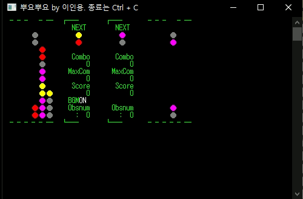
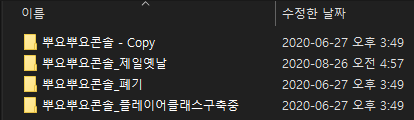
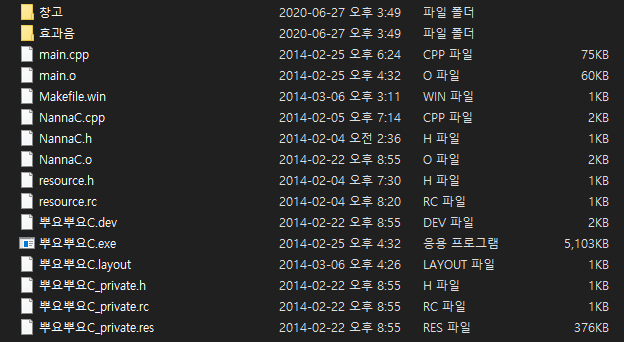

# Old Puyo C

[뿌요뿌요](https://ko.wikipedia.org/wiki/%EB%BF%8C%EC%9A%94%EB%BF%8C%EC%9A%94)를 CUI 기반으로 만든 것으로 대학 입학 직전에 만들었습니다.  
아카이빙 하기 위해 올립니다.  
사용된 BGM(bimbim.bbu)의 저작권은 저에게 있으니 함부로 사용하지 말아주세요.  
새로 잘 만들기 위해 노력한 것은 [https://github.com/Leeingnyo/newPuyoC](https://github.com/Leeingnyo/newPuyoC)를 참고하세요.

## 컴파일하는 법

dev c++을 받고 .dev 를 열어서 컴파일합니다.

## 실행

나온 exe를 실행하세요.

## 기타

소스 파일 관리 행태

